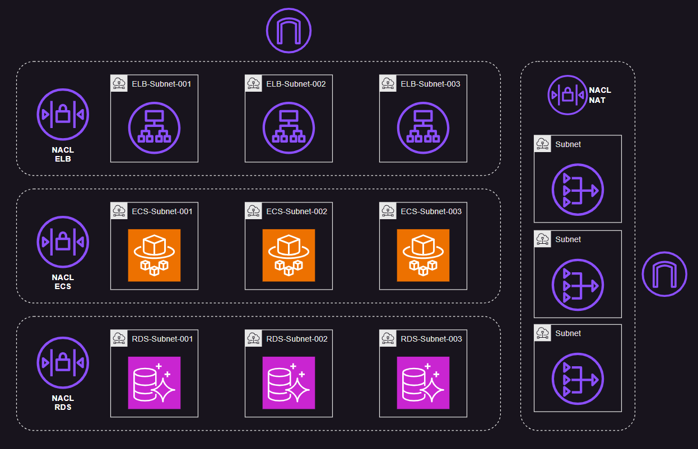

# AWS VPC Network ACL

Multi-tiered architecture with AWS Network ACL.



## Cloud

Apply the infrastructure:

```sh
terraform init
terraform apply -auto-approve
```

Once created, deploy the application from the `app` directory:

```sh
bash ecrBuildPush.sh
```

The application should be available. Test it hitting the ELB endpoints.


## Local

For local development:

```sh
docker run --name mysql-local -p "3306:3306" -e MYSQL_ROOT_HOST=% -e MYSQL_ROOT_PASSWORD=p4ssw0rd -d mysql:latest
```

Running the application:

```
go get
go run .
```

---

### Clean-up

Destroy the resources:

```sh
terraform destroy -auto-approve
```
